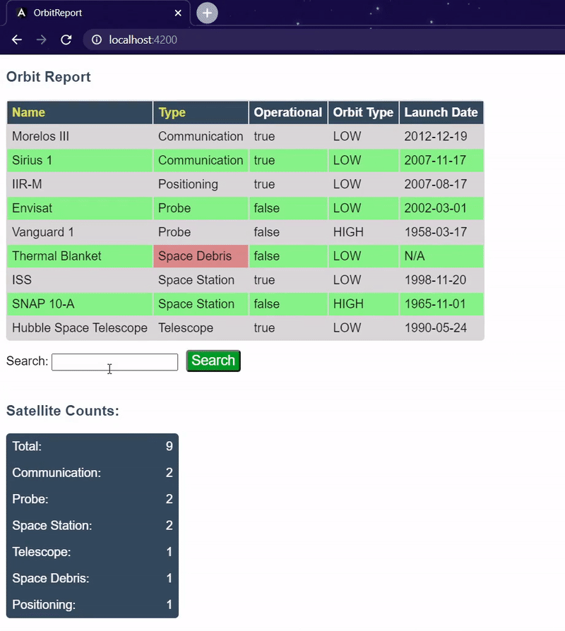
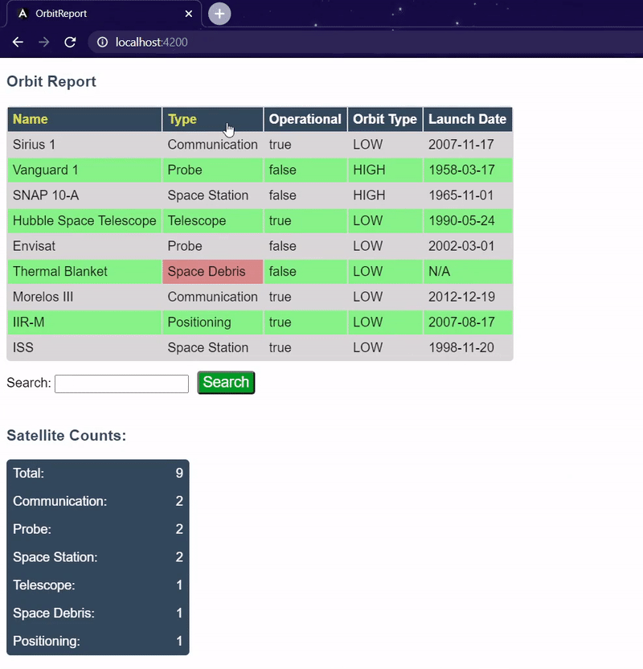
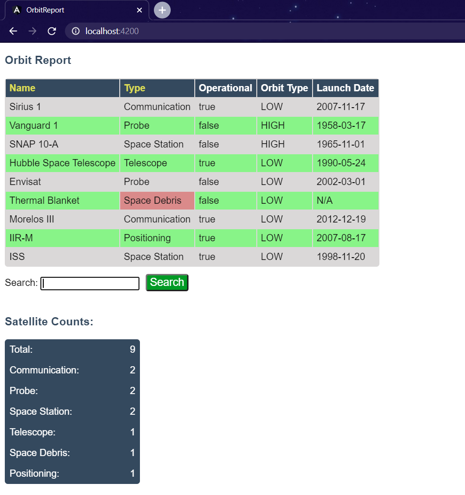
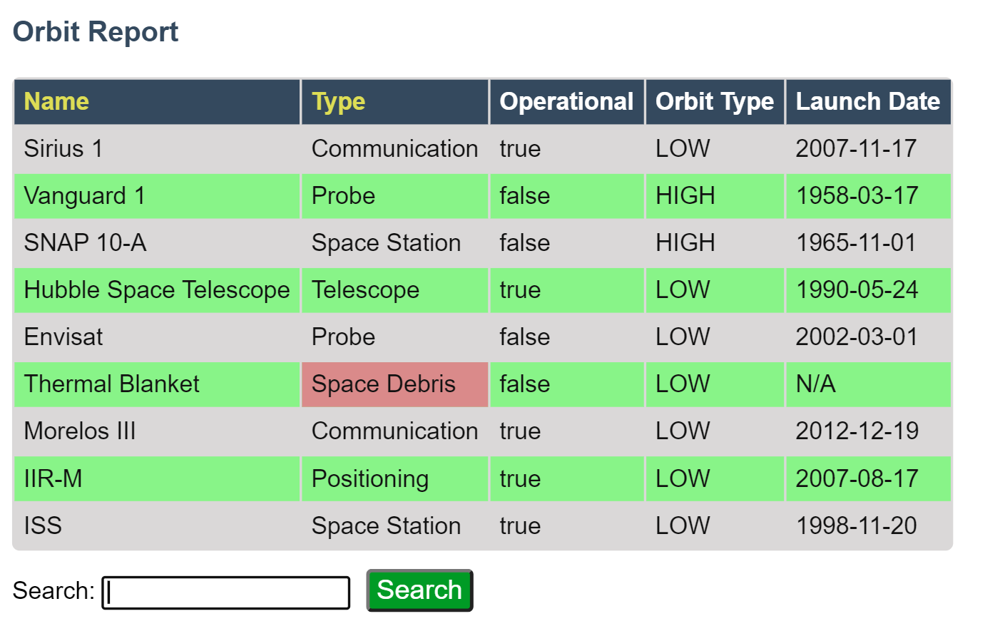
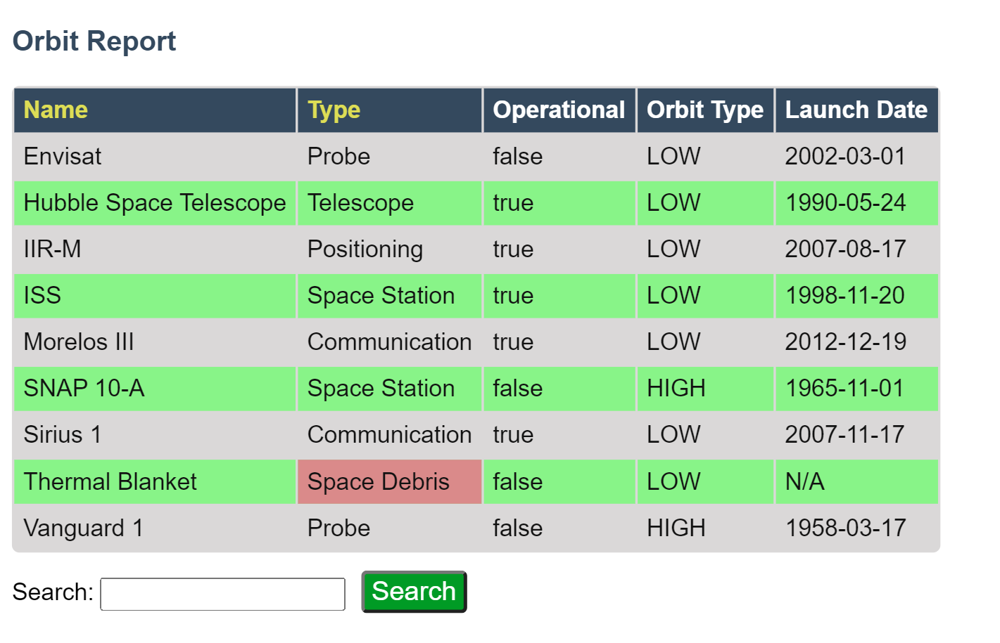
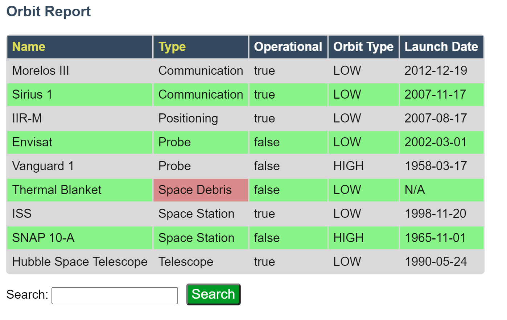
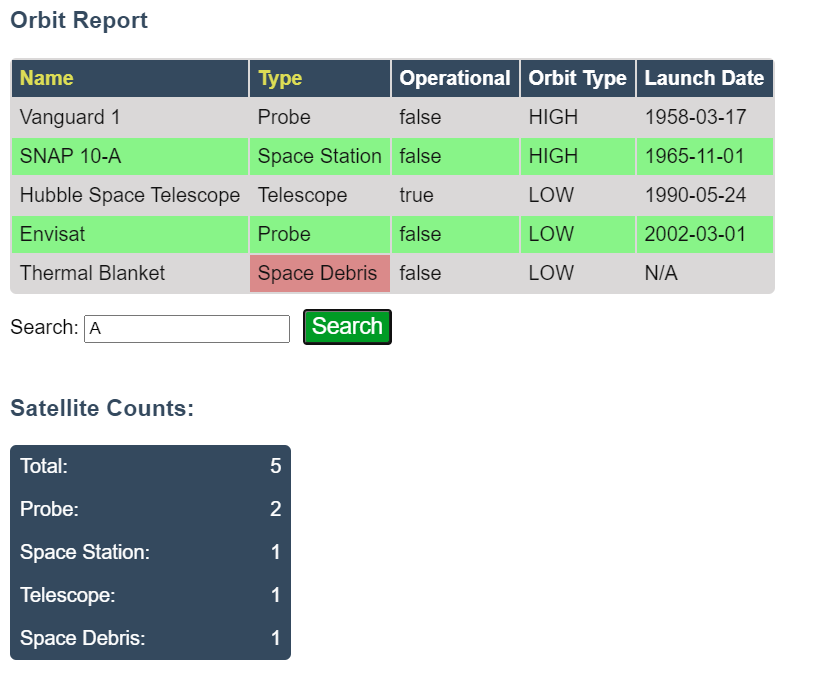
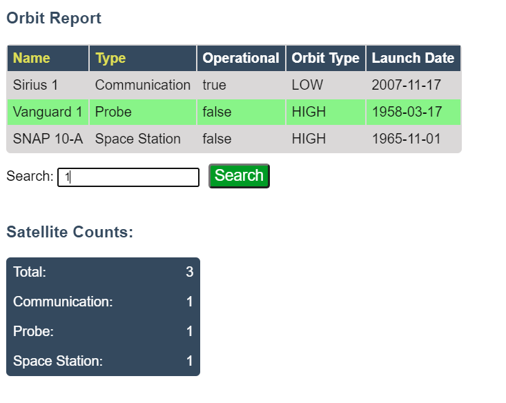
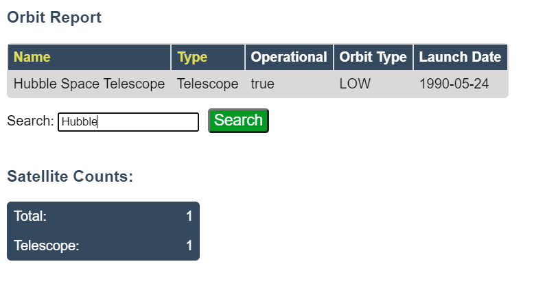

# Orbit Report

A basic Angular webpage featuring a searchable, sortable table of static satellite data.

*This program was a homework assignment at LaunchCode's Lc101 (2019)*

## Animated Demo (via gifs)

### Searching (Animated)

### Sorting (Animated)

# Still Images

### Default View

### Unsorted Table

### Sort Table by Name

### Sort Table by Type

### Search by pattern "A"

### Search by pattern " 1"

### Search by pattern "Hubble"

